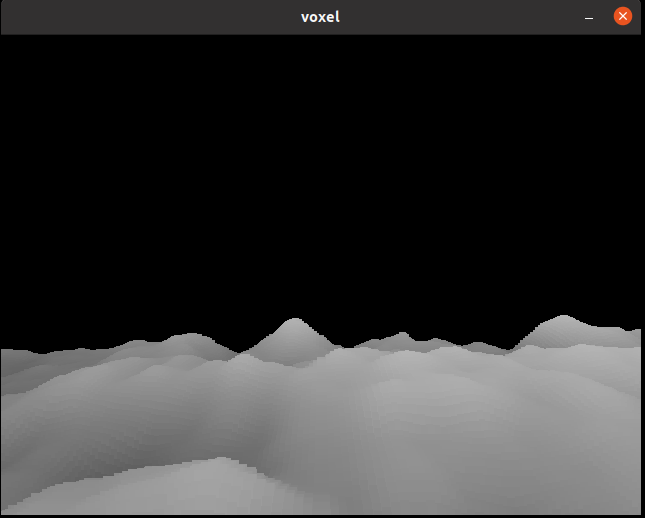
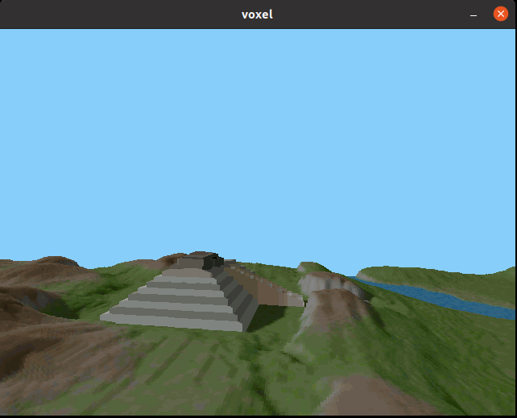
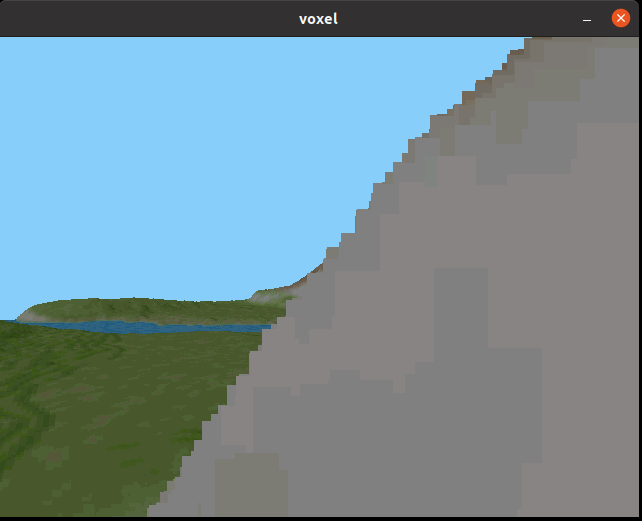

# Blog for project in DH2323

## First blog 3/5
I have set upp the project with all the libraries. I started with creating a quad in opengl
this quad had a texture on it that we can set the pixels on through a buffer of pixels on the 
cpu. I also managed to draw my first terrain after some debugging. I had a hard time getting 
the projection right and orientating the world. But after a while i got it working and 
managed to draw my first terrain. The color on the terrain is just determined by the height. My next 
step will be to implement a depth buffer. Right now I am using the painters algorithm and drawing
back to front with a lot of unnecessary drawing. I will also try to add camera rotation and 
movement besides up and down and also terrain color from a color map.

## Second blog 4/5
Since last time I implemented the depth buffer so it runs a lot faster. Colors can also be read from a color map to 
color the terrain. The camera can now also move around freely except for pitching upp and down. What I will do now
is implement the shadow baking. I also have an idea to interpolate between the pixel columns. I got the idea from this
*[page](https://web.archive.org/web/20131113102153/http://www.codermind.com/articles/Voxel-terrain-engine-beautification-features.html)*. This will hopefully make the terrain less pixilated.
*[Atmospheric perspective](https://en.wikipedia.org/wiki/Aerial_perspective) could also be pretty ease to implement. Note that the shadows in the terrain in the images bellow are not done by me. They are a part of the texture for the terrain. But my goal is to make a terrain without shadows in the terrain texture look like that.

